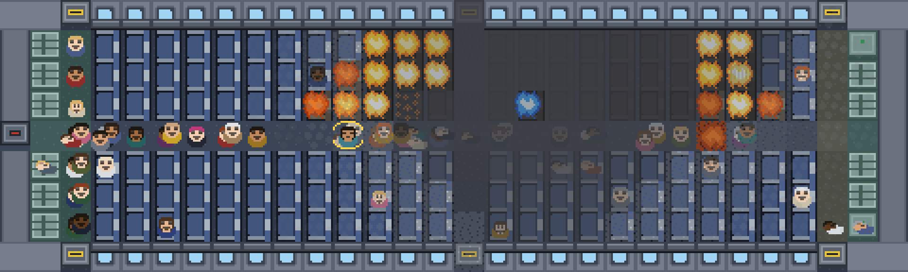

PLEASE REMAIN SEATED
====================

There is a fire in the overhead locker above seat 14C. You are the only person on this aeroplane
who has noticed. The plane lands in fifteen minutes, and the clock only moves when you do.

**Open `index.html`.** No build step, no server, no dependencies. If your browser is strict about
`file://`, `python tools/serve.py` serves it on http://localhost:8731.

*Four minutes to touchdown. The fire has the left bank of lockers from row 10 to row 17, the
seats under it are burnt through, twenty souls are forward in the aisle by the doors, seven
people are helping, and the flight deck has declared. Drawn by `tools/render_frame.py` from the
game's own simulation and sprite maps, so `--seed=606 --at=540` gives you this picture and not
one like it.*

The rules
---------

- **Time only passes when you act.** Every action costs seconds, and paying them is the only
  thing that moves the fire, the smoke, the passengers and the crew. Nine hundred seconds.
- **You cannot put the fire out.** It is a lithium cell in a vape in a hard case in a closed
  locker. Water cools it, halon smothers the flame, nothing reaches the cell. Nine cells, and
  every one of them is going to go.
- **Smoke is what kills.** It moves four times faster than the fire and fills from the ceiling
  down. A person on the floor is in different air from a person standing up.
- **Nobody believes you, and they are right not to.** Credibility rises with evidence: a
  photograph, an open bin, a burn on your hand, the lavatory smoke detector, somebody getting up
  to help. Every social action is gated on it.
- **You cannot save everybody.** Alone you can carry about twenty people in fifteen minutes. A
  recruited helper carries for the rest of the flight without being told, and the cabin has room
  for seven of them. The game never says out loud that this is the whole answer.
- **You can change your mind, not your luck.** Backspace undoes the last action and gives the
  seconds back, dice included, so a refusal cannot be re-rolled. Anything that told you something
  new stays done.

Controls
--------

The aeroplane is the menu. Click a person, the fire, or yourself and a card opens with the few
things you could do about it, each priced in seconds. Out of reach is not a dead click: the card
prices the walk and lists what you could do once there, and one click does both. Everything else
is floor, and clicking floor walks you there.

Arrow keys or WASD step. 1–9 pick a row of the open card. Backspace undoes. M mutes. ? shows the
help again.

Who you are
-----------

The title is a boarding pass. One click puts you on the aeroplane as whoever you were last time,
and the first time that is Dr Priya Ansel, who talks people out of their seats and cannot lift
the heavy ones. Under the name is the loadout: what you are wearing and the three things on you,
each a chip that opens a menu, except the ones that are part of who the character is, which are
locked in place. Deidre Volk always boards with her gloves and her tape; the other slot is yours.

"Change who you are" appears from the second flight and opens the roster: nine people, two of
them free. Gordy Mach carries two at a time and nobody listens to him. Each of the other seven is
locked behind something you do on the aeroplane, printed on the card, and each one makes you play
a different way to earn it: open the locker and look inside, recruit four helpers, carry five
people yourself, get the flight deck to declare inside five minutes, be told to sit down by three
different passengers, get a child forward, secure twenty-two souls.

There are no perks. Each person is five numbers, one to ten, and every number is a multiplier on
something you feel inside a minute: strength (how long a carry takes, who can be carried at all,
and at ten, two at once), speed, lungs, nerve, voice. What else makes them different is data the
game already understands: what is on them when they board, and which row they are sitting in.
Six outfits move the five numbers by a point or two; they unlock as the souls total in the log
book climbs, ten for the first and two hundred and forty for the last.

**The log book** is the only thing that carries over between flights: flights flown, souls
secured across all of them, every medal ever awarded, and the last sixty flights one line each.
Nothing is bought. Everything else in the aeroplane, from the galley drawers to what other
passengers have in their laps, is found in flight, and asking somebody what they have is the same
conversation that recruits them.

What is in it
-------------

- **81 actions** across seven decks, each with a cost, a condition and a line of text. Every one
  changes a number the score depends on. The ones that did not are in git history.
- **Nine characters, six outfits and a bag of three from a pool of nine.** Two characters are
  free; the rest are earned by playing a particular way. The outfits open with the souls total.
- **60 named passengers** with a weight, a temperament, a seat and an opinion, and a helper
  system that is the only thing in the game that scales. All sixty have faces: one map, sixty
  palettes, five expressions from five pixels moved.
- A **fire, smoke and heat simulation** over a 30×9 grid, with a core that suppression cannot
  reach.
- Cabin crew running a **six-phase procedure** that is excellent and is for a different fire.
- Seven events, 21 medals that each say one thing about the arithmetic, six endings, and an
  **incident report** in the flat voice of an air accident investigator: every soul by seat,
  your own actions quoted back in order, and where the fifteen minutes went.
- 31 synthesised sounds and no audio files.

How it is built
---------------

    index.html            the script order, which is the dependency graph
    game/
      art/                cabin-sprites.js, generated by pixel-workshop/make_cabin_textures.py
      engine/             seeded RNG and DOM sugar, sprite atlas, synthesised audio, renderer
      sim/                cabin geometry, fire, passengers, crew, the action engine, undo,
                          scoring, and the log book that carries over between flights
      data/               characters, outfits, items, the roster, events, medals, endings, the
                          action decks
      ui/                 hotspots (what a click means), the play screen, the other screens
      style.css
    pixel-workshop/       the art generator: every sprite is an ASCII map plus a palette
    tools/                the play-testers, the frame renderer, a no-cache dev server

Everything assigns to one global, `window.PRS`, because the game has to run from a double-clicked
file and `file://` will not load an ES module. `game/sim/actions.js` has the only function that
moves the clock; nothing else may call `fire.advance`, `pax.advance` or `crew.advance`.

An action is data:

    { id, deck, label, detail, cost, when, run, tags, danger, once, targets, item }

`targets` makes one definition appear once per person you can reach. `item` names the thing in
your bag it uses, which is how clicking the bottle finds everything the bottle can do. Add one to
a deck file and it is on the right card the next time the page loads. The rule for whether it
belongs: it has to change a number the score depends on, through a path the player can see, and
not be a dearer copy of something already on the card.

Testing it
----------

    node tools/simulate.js 300 --char=ansel   # six bots, the balance table, any crash
    node tools/simulate.js 100 --char=yuki --strategy=good --outfit=gym
    node tools/coverage.js                    # every action performed at least once
    node tools/test_undo.js                   # undo is exact and cannot buy a better roll
    node tools/dump_frame.js --at=540 --seed=606 && python tools/render_frame.py --out=docs/cabin.png
    python tools/trim_actions.py --list       # every action id; pass ids to remove them cleanly

The bots are deliberately stupid in different directions, and the table they print is what the
design aims at. Souls secured of 60, three hundred flights each:

| bot | what it does | Priya | Gordy |
|---|---|---|---|
| fire | only fights the fire | 1 | 1 |
| idle | never leaves the seat | 4 | 4 |
| random | anything | 9 | 6 |
| carry | carries and drags, one trip at a time | 20 | 22 |
| good | recruits early, then carries | 38 | 32 |

The fire bot has the fewest casualties of the five and secures almost nobody, because holding a
fire down keeps a cabin breathable and moves no one. If it ever scores well, the game has stopped
being about the thing it is about.

Text
----

Every sentence the player reads is in one of four places: `game/data/` (the decks, the roster,
the characters and outfits, events, medals, endings), `game/sim/crew.js` and `game/sim/pax.js` (what the
crew and the cabin say), `game/ui/` (title, help, HUD, report), and the renderer's five labels.
Nothing is assembled from English at runtime except names, seats and numbers. Translating the
game means those files.

The pixel-art idiom, one map and a palette per family, comes from the ProjectNauvis workshop
(MIT, JaguarM). Everything here was written for this game.
