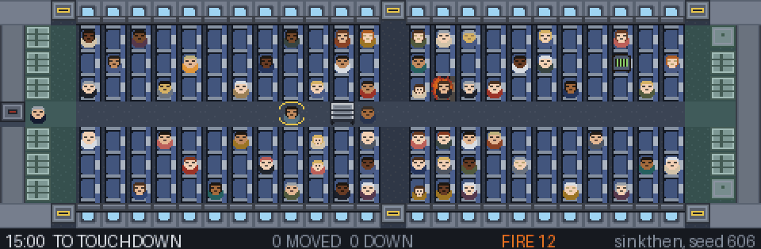

PLEASE REMAIN SEATED
====================

There is a fire in the overhead locker above seat 14C. You are the only person on this aeroplane
who has noticed. The plane lands in fifteen minutes, and the clock only moves when you do.

**Open `index.html`.** No build step, no server, no dependencies. If your browser is strict about
`file://`, `python tools/serve.py` serves it on http://localhost:8731.

*Four minutes to touchdown. The fire has the left bank from row 8 to row 22 and has already
burnt through the seats in the middle of it, the aisle is full of people who stood up, thirteen
have been moved to the floor by the doors, sixteen are down, and the flight deck has declared.
The blue one at 14C is not a hotter orange fire: at six minutes the pack goes to its second
stage, and what burns after that is a jet that water has no opinion about. Drawn by
`tools/render_frame.py` from the game's own simulation and sprite maps, so `--seed=606 --at=540`
gives you this picture and not one like it: every die in the flight is cast from the seed.*

The rules
---------

- **Time only passes when you act.** Every action costs seconds, and paying them is the only
  thing that moves the fire, the smoke, the passengers and the crew. Nine hundred seconds, and
  each action's go by on the aeroplane in front of you before you get to take the next one.
- **You cannot put the fire out.** It is a lithium cell in a vape in a hard case in a closed
  locker. Water cools it, halon smothers the flame, nothing reaches the cell. Nine cells, and
  every one of them is going to go. Fighting it still matters: it keeps the smoke down and the
  aisle walkable, and it comes down on the people sitting under it, who remember.
- **At six minutes it stops being a fire you are fighting.** The pack goes to a second stage and
  what burns after that is a blue jet of vented electrolyte: twice the fire, water does nothing
  to it, and a case out of the locker throws what it vents at whatever you parked it next to.
  Everything you do to it before that buys real time. Nothing you do to it after that does.
- **The jet is the case, not the tile.** A blue tile cannot be put out and running out of cells
  does not stop it. The only thing that clears one is picking the case up and carrying it
  somewhere else, and what you leave behind is an ordinary fire, which you can beat. So moving it
  is the one move that wins ground, and it costs both hands, a burn, and a walk down an aisle
  full of people holding the thing that is doing all this.
- **Smoke is what kills.** It moves four times faster than the fire and fills from the ceiling
  down. A person on the floor is in different air from a person standing up.
- **Nowhere is safe.** When the doors open, every passenger is judged where they are: the smoke
  they have breathed, the air where they are lying, whether they are low, whether anything is
  over their face, and the aisle between them and a door. The score is how many of the sixty get
  off alive.
- **Nobody believes you, and they are right not to.** Credibility rises with evidence: a
  photograph, an open bin, a burn on your hand, the lavatory smoke detector, somebody getting up
  to help. Every social action is gated on it. A sceptic is not gated on it at all: a sceptic is
  not talked round, a sceptic is shown, and until they have seen the photograph or the open bin
  or enough smoke to need neither, there is no sentence you own that will move them. The
  photograph works on each person once, because nobody looks at the same photograph twice.
- **You cannot save everybody.** Alone you can carry a handful of people the length of the
  cabin. A recruited helper moves people for the rest of the flight without being told, and there
  is no ceiling on how many of them there can be: the limit is the aeroplane. What stops the
  eighth from being as cheap as the second is that everybody still sitting down by then is
  somebody who has already said no, and the aisle they would be working is fuller than it was.
  Fifty-four is very hard, and sixty is not on offer.
- **You can change your mind, not the dice.** Every die in the flight is cast at boarding, from
  the seed on the pass: what mood each passenger is in, when the fire jumps a row, what the cabin
  does on its third turn. Backspace undoes the last action and gives the seconds back, one action
  at a time, and so does walking back: every walk leaves the tile you left from marked on the
  floor behind you, and stepping onto one of those is the walks since then undone. A refusal
  undone is a refusal again, whatever you do first. Anything that told you something new stays
  done.

Languages
---------

The game is in English and in German, and **Einstellungen** on the title screen (or Escape, in
the air) has the picker, next to a volume slider. It opens in the language your browser is set
to, and the choice outlives the tab. Changing it mid-flight redraws the cabin, the cards and the
tooltips at once; the lines already in the log stay in the language they were written in,
because the log is a record of what happened and rewriting it underneath you would be a strange
thing to do.

A new language is a folder of catalogues and no changes to the game. The key is the English
sentence itself, so a missing line is the English and never an empty box, and

    node tools/i18n_scan.js          what each language has and has not
    node tools/i18n_scan.js de       the lines still to write, as a stub catalogue
    node tools/i18n_scan.js de --stale   lines the game no longer says

reads the source rather than a play-through, which means a sentence changed in the game shows up
as a line to rewrite in every language the next time anybody looks. The parts of a language that
are rules rather than sentences - "eine Rauchhaube" against "ein Inhalator", where to stand
against where to go - are registered by the catalogue itself through `PRS.i18n.grammar`, so the
game never has to guess at a grammar it does not have.

Controls
--------

The aeroplane is the menu. Click a person, the fire, or yourself and a card opens with the few
things you could do about it, each priced in seconds. Out of reach is not a dead click: the card
prices the walk and lists what you could do once there, and one click does both. Everything else
is floor, and clicking floor walks you there.

Arrow keys or WASD step, and a step back onto the trail behind you is a step back in time. 1–9
pick a row of the open card. Backspace undoes. M mutes. Escape closes whatever is open over the
cabin, and opens the settings when there is nothing left to close. The settings hold the sound,
the language, the help card and the way out of a flight, which asks first, because a flight is
saved nowhere and leaving one is leaving it.

Who you are
-----------

The title is a boarding pass and nothing else: a face, a name, a seat, one line about what that
person is for, and the button. One click puts you on the aeroplane as whoever you were last
time, and the first time that is Dr Priya Ansel, who talks people out of their seats and cannot
lift the heavy ones.

"Change who you are" appears from the second flight and holds everything you can change. The
loadout is there: what you are wearing and the three things on you, each a box that opens a page
of choices, except the ones that are part of who the character is, which have a lock in the
corner. Deidre Volk always boards with her gloves and her tape; the other slot is yours.

The fifth box is the seed. Leave it and every flight is a new one; type a number or a word and it
is the same aeroplane, the same moods and the same fire until you clear it, which is how two
people compare what they did with one fifteen minutes, and `index.html?seed=606` opens with it
filled in.

The same screen opens the roster: nine people, two of them free. Gordy Mach carries two at a time
and nobody listens to him. Each of the other seven is locked behind something you do on the
aeroplane, printed on the card, and each one makes you play a different way to earn it: open the
locker and look inside, recruit four helpers, carry five people yourself, get the flight deck to
declare inside five minutes, be told to sit down by three different passengers, get a child out of
the rows, get fifty-two people off alive.

There are no perks. Each person is four numbers, one to ten, and every number is a multiplier on
something you feel inside a minute: strength (how long a carry takes, who can be carried at all,
and at ten, two at once), speed, lungs, voice. What else makes them different is data the
game already understands: what is on them when they board, and which row they are sitting in.
Six outfits move the four numbers by a point or two; they unlock as the souls total in the log
book climbs, ten for the first and five hundred for the last.

**The log book** is the only thing that carries over between flights: flights flown, souls saved
across all of them, every medal ever awarded, and the last sixty flights one line each. Saved,
not survived: forty-odd people get off this aeroplane whatever you do, so the book credits the
difference between the flight you flew and the same aeroplane with you asleep in 9C, which is the
number the screen after the report is about and the only number that fills the bar. Nothing is bought. Everything else in the aeroplane, from the galley drawers to what other
passengers have in their laps, is found in flight, and asking somebody what they have is the same
conversation that recruits them.

Today's flight
--------------

Everything a daily needs was already in the game and was not pointed at a date. Every die in a
flight is cast at boarding from one seed, so two people who type the same number get the same
sixty people in the same moods and the same fire; all this does is hash the date instead of
asking. **Today's flight** is under the boarding pass on the title screen, and the day is the
same aeroplane for everybody who boards it, which is the only condition under which "I got 44" is
a sentence worth saying to anybody.

What stands for a day is the first flight you land on it. Flying it again is allowed and the log
book credits it like any other flight, because the aeroplane does not care - but the day's line
stays the one you got the first time, and the screen says so rather than quietly keeping the
better number. A leaderboard of best-of-nine attempts is a leaderboard about who had the
afternoon free.

Telling somebody
----------------

The report ends in four lines to paste into a message:

    PLEASE REMAIN SEATED · TN 447 · daily 2026-09-13
    36 of 60 off alive · 18 who would not have been · D · Deidre Volk
    🟧🟩🟦🟦🟦🟦🟦🟧🟧🟧⬜⬜⬜⬜⬛
    TN447-GoprAJ--YmGDg2jZISYCp8DBQKAo-9sJW8o7SZA8Oo1TYCAgIJvd

One block a minute, coloured by what most of that minute actually went on - the fire, carrying,
talking, everything else - and a black one for a minute that never happened, because the flight
deck declared and took ninety seconds off the descent. Three orange then a run of blue is a plan.
A wall of white is an afternoon.

The fourth line is the flight. Not a summary of it: the seed, who you were, what was in your bag
and every click in order, in about a hundred characters and never more than two hundred and
fifty. Paste it into **A flight somebody sent you** on the seed screen, or open
`index.html?flight=TN447-...`, and you are on their aeroplane with their cabin running underneath
yours, on the same clock, for the whole fifteen minutes. It is not a recording being scrubbed: it
is the same simulation running beside yours, cast from the same seed, so their smoke is smoke and
the moment they got the case into the basin is the moment it happens down there.

**How a hundred characters is a whole flight.** At any moment there is a list of everything you
could do - two hundred and some, most of them walks - and the simulation is deterministic, so a
replay can build that same list at that same moment. So the code does not carry the actions. It
carries which row of the list you picked, and a number under three hundred is nine bits. The list
is ordered by the action's id rather than by its label, because a label is a translated sentence
and a flight flown in German has to replay in English.

The cost of that is honesty about versions: add an action to a deck and every list in every
flight shifts underneath, and a code from yesterday would land somebody else's afternoon in the
wrong cabin without ever looking wrong. So the code carries a sixteen-bit stamp of every id the
lists are built from, and a code with the wrong stamp is refused rather than flown - with the
seed offered instead, because the aeroplane is still the aeroplane.

`node tools/test_share.js` is the only test that matters for that: it flies a hundred and twenty
bot flights, writes each one out, reads it back, flies it again from the code alone and insists
that the same sixty people come off in the same condition. Then it registers one more action and
watches every code it just wrote be refused.

A flight as a picture
---------------------

*The whole of one flight, every fourteen seconds of it. `tools/dump_flight.js` flies it - a bot,
a shared code, or a flight out of the recorder - and takes a picture whenever the clock has moved
on far enough, one sub-step at a time, which is why the caption under the cabin says the played
time and not the paid one. `tools/render_gif.py` draws every frame with the same function that
draws the still at the top of this file. No browser is involved in either.*

    node tools/dump_flight.js --bot=sinkthen --seed=606 --every=14
    python tools/render_gif.py --ms=110

    node tools/dump_flight.js --code=TN447-...      # the flight somebody sent you
    node tools/dump_flight.js --flight=flights.json --only=0
    python tools/render_gif.py --from=300 --to=600  # just the bad four minutes

A cabin is thirty tiles by nine, which is a letterbox, and a shop page wants a rectangle. So it
crops in tiles and pads what is left onto a canvas of a given size:

    node tools/dump_flight.js --bot=blend --seed=1 --every=14
    python tools/render_gif.py --out=docs/itch/cover.gif --crop=11,0,13,9 --scale=3 \
        --pad=630x500 --fields=1 --what="PLEASE REMAIN SEATED" --to=620

Thirteen rows either side of the locker above 14C, on the 630x500 an itch.io cover wants, stopping
at three minutes out - because the crop cannot see the doors, and everybody who was carried
forward is outside it by the end, so the last seconds would read as a cabin nobody got off.
`--fields` trims the caption, which has room for the word TOUCHDOWN on a whole aeroplane and not
on a third of one, and `--what` replaces the dev label, because "blend, seed 1" is for this file
and not for a shop. `docs/itch/` is not committed: those are a megabyte each, one command
remakes them, and the copy that matters is the one itch.io is serving.

What is in it
-------------

- **81 actions** across seven decks, each with a cost, a condition and a line of text. Every one
  changes a number the score depends on. The ones that did not are in git history.
- **Nine characters, six outfits and a bag of three from a pool of nine.** Two characters are
  free; the rest are earned by playing a particular way. The outfits open with the souls total.
- **60 named passengers** with a weight, a temperament, a seat and an opinion, and a helper
  system that is the only thing in the game that scales. All sixty have faces: one map, sixty
  palettes, five expressions from five pixels moved.
- A **fire, smoke and heat simulation** over a 30×9 grid, with a core that suppression cannot
  reach.
- Cabin crew running a **six-phase procedure** that is excellent and is for a different fire.
- Seven events, 26 medals that each say one thing about the arithmetic, six endings, and an
  **incident report** in the flat voice of an air accident investigator: every soul by seat,
  your own actions quoted back in order, and where the fifteen minutes went. Then one more
  screen: what you changed, what the book credited for it, and the locked person you came
  nearest to.
- A **flight recorder**, which keeps your last thirty flights and plays them back. It is at the
  bottom of the share panel behind a button, because it is not a second way to send a flight to
  a player: it is how somebody hands their last run to whoever is building the aeroplane.
- **One aeroplane a day**, the same one for everybody, with the first flight you land on it the
  one that stands, and a book of days behind it that counts the run.
- **A whole flight as a line of text**, about a hundred characters of it, which somebody else
  pastes back in to fly your fifteen minutes with your cabin running under theirs.
- A **title screen that is flying**. The cabin behind the boarding pass is not artwork: it is the
  simulation, on a random seed, with one of the bots from `game/sim/bots.js` at the controls,
  slowed down to a speed a person can watch and muted so that a menu never makes a noise at
  somebody who has not pressed anything. It lands, and another one takes off.
- 31 synthesised sounds and no audio files.
- **English and German**, every word of both, from the title screen to the sixty passengers'
  refusals to the incident report: 1,134 lines, and a scanner that says what a language is
  missing before a player finds out.

How it is built
---------------

    index.html            the script order, which is the dependency graph
    game/
      art/                cabin-sprites.js, generated by pixel-workshop/make_cabin_textures.py
      engine/             the dice (one seed, a stream per named thing), DOM sugar, sprite
                          atlas, synthesised audio, renderer
      sim/                cabin geometry, fire, passengers, crew, the action engine, undo,
                          scoring, the log book that carries over between flights, the
                          flight recorder, the day's aeroplane, the flight as a line of
                          text, and the bots
      data/               characters, outfits, items, the roster, events, medals, endings, the
                          action decks
      i18n/               the translator, and one folder of catalogues per language
      ui/                 hotspots (what a click means), the play screen, the other screens,
                          the settings panel, and the cabin behind the title
      style.css
    pixel-workshop/       the art generator: every sprite is an ASCII map plus a palette, and
                          --preview draws the whole set on one sheet, in context and by name
    tools/                the play-testers, replay and harm, the frame renderer and the
                          animator that is the same renderer in a loop, a dev server

Everything assigns to one global, `window.PRS`, because the game has to run from a double-clicked
file and `file://` will not load an ES module. `game/sim/actions.js` has the only function that
moves the clock: a passage of twelve-second sub-steps, which the bots and the replays take in one
go and the play screen takes a frame at a time, so that an action's seconds can be watched going
by. Nothing else may call `fire.advance`, `pax.advance` or `crew.advance`.

An action is data:

    { id, deck, label, detail, cost, when, run, tags, danger, once, targets, item }

Every string a player can read goes through `T()`, keyed on the English sentence. A `label` that
is a plain string is that English, marked `K()`, and is translated where the card is built; a
`label` that is a function runs with the state in front of it and calls `T()` on its own pieces.
Interpolation is `{name}`, never `+`, because German does not put the pieces of a sentence in
the order English does and a translator has to be able to move them.

`targets` makes one definition appear once per person you can reach. `item` names the thing in
your bag it uses, which is how clicking the bottle finds everything the bottle can do. Add one to
a deck file and it is on the right card the next time the page loads. The rule for whether it
belongs: it has to change a number the score depends on, through a path the player can see, and
not be a dearer copy of something already on the card.

Testing it
----------

    node tools/simulate.js 360 --char=ansel   # the bots, the balance table, any crash
    node tools/simulate.js 100 --char=yuki --strategy=good,blend --outfit=gym
    node tools/simulate.js 8 --seed=1         # every bot once, one aeroplane: the plans alone
    node tools/harm.js 60 --strategy=idle     # where the harm at touchdown comes from, by part
    node tools/replay.js flights.json         # play recorded flights back against the bots
    node tools/coverage.js                    # every action performed at least once
    node tools/test_fire_strats.js            # every known way to play the fire, flown: nobody
                                              # saves sixty, and fighting it is neither the whole
                                              # game nor a waste of the seconds
    node tools/test_undo.js                   # undo is exact; neither it nor a detour buys a roll,
                                              # and a second played slowly is the same second
    node tools/test_share.js                  # every bot flight written out as a code and flown
                                              # again from it alone: the same sixty people in the
                                              # same condition, and a code from another build
                                              # refused rather than quietly flown
    node tools/i18n_scan.js                   # what each language has, and what it is missing
    node tools/dump_frame.js --at=540 --seed=606 && python tools/render_frame.py --out=docs/cabin.png
    node tools/dump_flight.js --seed=606 && python tools/render_gif.py   # the whole flight, moving
    python tools/trim_actions.py --list       # every action id; pass ids to remove them cleanly

The bots are deliberately stupid in different directions, and the table they print is what the
design aims at. Survivors of 60 as Priya, sixty flights each:

| bot | what it does | survived | best |
|---|---|---|---|
| idle | does nothing at all: the report's "without you" | 18 | 26 |
| fire | only the fire deck, wherever it happens to be standing | 25 | 37 |
| douse | the first playtest: pours from where one pour reaches the most fire, refills at the tap | 24 | 32 |
| carry | carries whoever is worst off to the best floor by a door | 24 | 35 |
| good | recruits early, then carries | 27 | 40 |
| blend | two or three minutes at the fire while it is small, then recruits and carries | 31 | 43 |
| hold | never opens the locker: closes it, tapes it, holds it shut | 15 | 18 |
| mover | never lets the case settle: lifts it and puts it down somewhere else, over and over | 17 | 24 |
| forward | carries the case the other way and leaves it in the forward galley | 6 | 16 |
| sink | a playtester's line: the case into the basin as fast as possible, then live at the tap | 34 | 43 |
| aftline | the basin, then hold the ground round it with everything wet | 33 | 44 |
| sinkthen | the basin, and then other people | 37 | 47 |

No bot that does one thing is far ahead of the others, and the one that does two is ahead of all
of them. If a fire-only bot ever leads the table, fighting the fire has become the whole game
again; if the best of them falls to the idle line, it has stopped being worth doing. That is not
a thing to remember: `node tools/test_fire_strats.js` asserts it, and fails with a sentence saying
which of the two happened.

The bottom six rows are lines real playtesters found, and they are in the file because two of them
returned sixty of sixty before they were bots. What the table says now is the shape the game is
meant to have: moving the vape is the strongest thing you can do to the fire (`sink`, `aftline`),
doing it and then turning round and moving people beats it (`sinkthen`), never opening the locker
is worse than doing nothing at all (`hold`), and carrying the burning case the length of the cabin
past fifty-eight people is the worst idea in the game (`forward`, six).

**Playtesting.** Two things on the report send a flight somewhere, and they are addressed to
different people. The four lines and the code are for another player, and that is the whole of
what they are for. Underneath them, behind *Or hand this run to whoever made the aeroplane*, is
the flight recorder: the same flight in the long form - fourteen hundred characters against the
code's hundred - with every action in it and a box for what you were trying to do, which is the
one thing neither a code nor a replay can work out. "Copy this flight" is the big button there,
because handing over the run just flown is what somebody opened it for; the file of thirty is
under it, for a whole afternoon at once.

`tools/replay.js` reads either file and replays every flight in it exactly, then flies the same
seed with the idle, douse, good and blend bots, so a flight a person played can be read against
the table.

Publishing it
-------------

The game is on itch.io at <https://jaguarm.itch.io/please-remain-seated>, and it goes there with

    python tools/publish_itch.py              # builds, then pushes with butler
    python tools/publish_itch.py --dry-run    # builds and stops
    python tools/serve.py 8745 dist/web       # play the build, not the working tree

`tools/build_web.py` reads index.html and copies exactly the files index.html loads into
`dist/web`, which is fifty-five files and 982 kB. That is not tidiness. itch.io refuses an
HTML5 upload with more than a thousand files in it, and this folder zipped whole is twelve
hundred: nine hundred of them are git objects, and the rest are the sprite generator, the frame
renderer, `__pycache__` and a README with a picture in it. None of that is the aeroplane.

Because the list comes out of index.html rather than being written down twice, a script added to
the page is in the next build and a script taken off it is not. If the page asks for a file that
is not on disk the build stops instead of shipping without it.

The channel is `html5` and the name is load-bearing: itch treats a build as playable in the
browser when the channel name contains "html", so `web` would upload a download. The build is
stamped with the git commit it came from, which is how you tell later which one is on the page.
butler sends only changed blocks, so a typo fix is a twenty-kilobyte upload.

The page settings live on itch and are set by hand once: kind "HTML", the html5 upload ticked as
played in the browser, and a viewport of about 1280x900 with the fullscreen button on. The
layout is `100vh` with a breakpoint at 1000px, so anything narrower than that gets the stacked
version in a small box, which is not the game.

Text
----

Every sentence the player reads is in one of four places: `game/data/` (the decks, the roster,
the characters and outfits, events, medals, endings), `game/sim/crew.js` and `game/sim/pax.js` (what the
crew and the cabin say), `game/ui/` (title, help, HUD, report), and the renderer's five labels.
Nothing is assembled from English at runtime except names, seats and numbers. Translating the
game means those files.

The pixel-art idiom, one map and a palette per family, comes from the ProjectNauvis workshop
(MIT, JaguarM). Everything here was written for this game.
